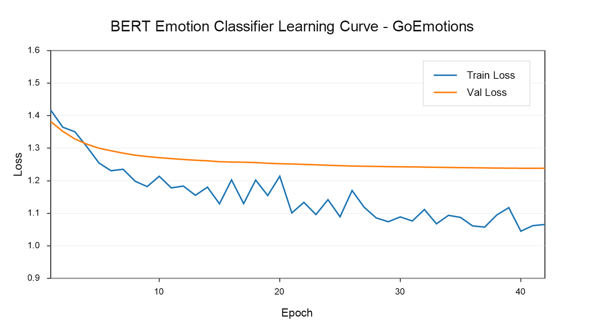
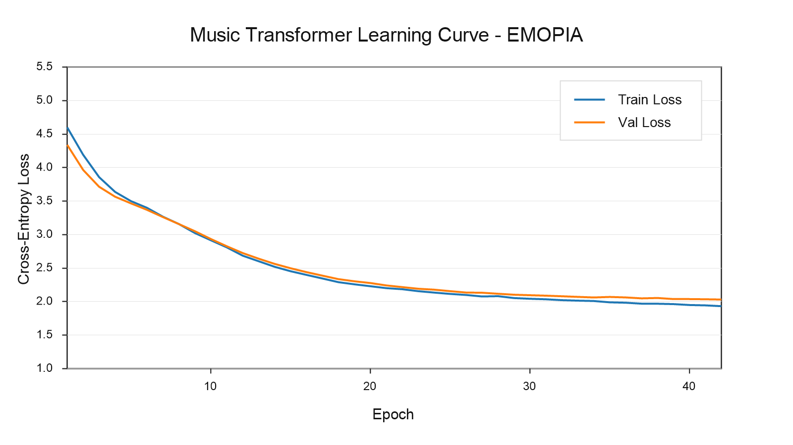

# MUSEmotion

MUSEmotion turns emotion-laden text into a short piano MIDI clip that matches the user's mood. It is built as a full training pipeline for ECE1508, with one model for text emotion classification and one model for conditional symbolic music generation.

## Project Status

This repository contains the end-to-end code structure for:

- fine-tuning BERT on GoEmotions labels mapped into EMOPIA quadrants
- preprocessing EMOPIA piano MIDI files into autoregressive event tokens
- training an emotion-conditioned Transformer music generator
- generating MIDI from free-form text
- launching a Gradio frontend for interactive demos
- running local unit tests without downloading large datasets
- running a verified Colab T4 smoke workflow with the official EMOPIA archive
- shipping real 42-epoch training charts and lightweight trained checkpoints from the latest real-data run

Large datasets and bulky per-epoch optimizer checkpoints are intentionally excluded from git. The repository keeps a lightweight real-run checkpoint snapshot for presentation and reproducibility.

## System Overview

```text
User text
  -> BERT emotion classifier
  -> EMOPIA quadrant Q1/Q2/Q3/Q4
  -> conditional Transformer decoder
  -> symbolic note tokens
  -> piano MIDI file
```

The classifier and generator share the same four-label emotion space:

- `Q1`: high valence, high arousal, positive and energetic
- `Q2`: low valence, high arousal, negative and energetic
- `Q3`: low valence, low arousal, negative and subdued
- `Q4`: high valence, low arousal, positive and calm

## Repository Layout

```text
configs/                 YAML configs for classifier, generator, and inference
docs/superpowers/        Design and implementation planning notes
notebooks/               Colab workflow notebook
src/musemotion/          Python package and CLI modules
tests/                   Local tests with synthetic fixtures
figures/                 Real training charts and CSV metric histories
models/real_training/    Lightweight checkpoints from the real 42-epoch runs
data/raw/emopia/         Expected EMOPIA dataset location, ignored by git
artifacts/               Generated datasets, checkpoints, metrics, and samples
```

## Setup

Windows PowerShell:

```powershell
python -m venv .venv
.\.venv\Scripts\Activate.ps1
pip install -r requirements.txt
pip install -e . --no-deps
```

macOS, Linux, or Colab:

```bash
pip install -r requirements.txt
pip install -e . --no-deps
```

## Data Requirements

GoEmotions is loaded directly through Hugging Face Datasets during classifier training:

```python
from datasets import load_dataset
load_dataset("go_emotions")
```

EMOPIA can be downloaded directly from the official Zenodo archive:

```bash
python -m musemotion.cli.download_emopia --output data/raw/emopia
```

The downloader retrieves `EMOPIA_1.0.zip` from [Zenodo record 5090631](https://zenodo.org/records/5090631), extracts it, and leaves MIDI files under:

```text
data/raw/emopia/
```

The EMOPIA preprocessing command recursively scans for `.mid` and `.midi` files whose path contains `Q1`, `Q2`, `Q3`, or `Q4`.

## Training Workflow

Run the stages in this order.

### 1. Train The Emotion Classifier

```bash
python -m musemotion.cli.train_classifier --config configs/classifier.yaml
```

Outputs:

```text
artifacts/classifier/
  metrics.json
  label_mapping.json
  tokenizer files
  fine-tuned BERT checkpoint
```

### 2. Tokenize EMOPIA

```bash
python -m musemotion.cli.prepare_emopia --config configs/music.yaml
```

Outputs:

```text
artifacts/music/tokenizer/vocab.json
artifacts/music/tokenized/train.jsonl
artifacts/music/tokenized/validation.jsonl
artifacts/music/tokenized/test.jsonl
```

Each note is encoded as a compact event group:

```text
SHIFT, PITCH, DUR, VEL
```

### 3. Train The Music Generator

```bash
python -m musemotion.cli.train_generator --config configs/music.yaml
```

The generator is a decoder-only Transformer trained with next-token maximum likelihood. It conditions every timestep on an emotion embedding. Checkpoints are written to:

```text
artifacts/music/checkpoints/
```

## Inference

The default [`configs/inference.yaml`](configs/inference.yaml) uses the lightweight trained checkpoints committed under [`models/real_training/`](models/real_training/). Generated MIDI files are still written to ignored `artifacts/samples/` by default.

Generate a MIDI file from text:

```bash
python -m musemotion.cli.generate \
  --text "I feel hopeful but calm today" \
  --output artifacts/samples/demo.mid
```

The command prints JSON metadata containing the predicted quadrant, confidence, token count, and output MIDI path.

On Windows PowerShell, use backticks for multiline commands:

```powershell
python -m musemotion.cli.generate `
  --text "I feel hopeful but calm today" `
  --output artifacts/samples/demo.mid
```

## Frontend Demo

```bash
python -m musemotion.frontend.app --config configs/inference.yaml
```

The Gradio app provides:

- text input for the user's emotional state
- generation controls for temperature, top-k, max tokens, and seed
- predicted quadrant metadata
- downloadable generated MIDI output

## Colab

Use [notebooks/musemotion_colab.ipynb](notebooks/musemotion_colab.ipynb) for a shareable Colab workflow. The notebook installs dependencies, verifies the committed checkpoints, generates a MIDI sample from the GitHub model, and can launch the Gradio demo.

Open the shareable notebook in Google Colab:

[`https://colab.research.google.com/github/Alex-Xi-Chen/ECE1508-Deep-Generative-Models/blob/main/notebooks/musemotion_colab.ipynb`](https://colab.research.google.com/github/Alex-Xi-Chen/ECE1508-Deep-Generative-Models/blob/main/notebooks/musemotion_colab.ipynb)

The first runnable path uses:

```text
configs/inference.yaml
models/real_training/classifier_tiny_bert_42epoch/
models/real_training/music_transformer_42epoch/
```

The optional final cells download EMOPIA and re-run the capped smoke training flow using:

```text
configs/colab_smoke_classifier.yaml
configs/colab_smoke_music.yaml
configs/inference_colab_smoke.yaml
```

The smoke configs intentionally cap samples and use a smaller generator so the complete training path can run quickly on Colab. Use `configs/classifier.yaml`, `configs/music.yaml`, and `configs/inference.yaml` for longer full runs.

## Colab T4 Run Results

Verified on June 22, 2026, using Google Colab with a Tesla T4 runtime:

```text
torch 2.11.0+cu128
cuda_available True
cuda_device Tesla T4
Tesla T4, 15360 MiB, driver 580.82.07
pytest: 19 passed in 2.90s
```

Dataset download and discovery:

```text
EMOPIA dataset ready at /content/ECE1508-Deep-Generative-Models/data/raw/emopia
emopia_midi_count 1078
emopia_quadrant_counts {'Q1': 250, 'Q2': 265, 'Q3': 253, 'Q4': 310}
```

Smoke BERT classifier fine-tuning:

```text
train_runtime 8.419s
train_loss 1.28
test eval_accuracy 0.5357
test eval_macro_f1 0.1744
test eval_loss 1.2021
```

Smoke music preprocessing and generator training:

```text
tokenized_train_count 52
tokenized_validation_count 6
tokenized_test_count 6
epoch=1 train_loss=4.7669 validation_loss=4.4705
```

End-to-end generated sample:

```text
input_text "I feel hopeful but calm today"
predicted_quadrant Q4
confidence 0.3413
token_count 174
sample_path artifacts/colab_smoke/samples/hopeful_calm.mid
sample_exists True
sample_size_bytes 112
sample_note_count 5
sample_duration_seconds 4.25
```

The smoke run proves the pipeline executes end to end on GPU. The musical quality should improve with the uncapped configs and longer generator training.

## Real Multi-Epoch Training Results

Updated after commit `658280f` on June 25, 2026. The `figures/` folder now keeps only real-data training charts and CSV records; mock charts, one-epoch smoke charts, and the old nested chart folder were removed.

The following curves are generated from real 42-epoch training histories saved as CSV files in `figures/`.

Classifier run:

- dataset: real GoEmotions subset mapped to EMOPIA quadrants
- model: pretrained `prajjwal1/bert-tiny`
- history: [`figures/classifier_training_history.csv`](figures/classifier_training_history.csv)



Music generator run:

- dataset: real EMOPIA MIDI subset, 76 train / 10 validation / 10 test tokenized clips
- model: emotion-conditioned Transformer
- history: [`figures/music_generator_training_history.csv`](figures/music_generator_training_history.csv)



Additional real-data visualizations are saved directly under `figures/`:

- [`learning_curves_42epochs.png`](figures/learning_curves_42epochs.png)
- [`performance_comparison.png`](figures/performance_comparison.png)
- [`overfitting_analysis.png`](figures/overfitting_analysis.png)
- [`best_metrics.png`](figures/best_metrics.png)
- [`final_train_vs_validation_loss.png`](figures/final_train_vs_validation_loss.png)
- [`performance_summary_table.png`](figures/performance_summary_table.png)
- [`real_training_summary.csv`](figures/real_training_summary.csv)

The lightweight trained checkpoints from these real runs are committed under [`models/real_training/`](models/real_training/):

- [`models/real_training/classifier_tiny_bert_42epoch/`](models/real_training/classifier_tiny_bert_42epoch/)
- [`models/real_training/music_transformer_42epoch/`](models/real_training/music_transformer_42epoch/)

Large datasets and per-epoch optimizer checkpoints remain excluded from git.

## Local Verification

The local tests are designed to run without GoEmotions, EMOPIA, GPU access, or trained checkpoints.

```bash
pytest -q
```

Current local coverage includes:

- YAML config loading
- GoEmotions-to-EMOPIA mapping
- Hugging Face GoEmotions dataset compatibility
- official EMOPIA archive download and retry behavior
- MIDI token encode/decode behavior
- tokenized dataset collation
- Transformer forward pass and loss shape
- CLI import safety
- inference orchestration with fake components

## Configuration

- `configs/classifier.yaml`: BERT model name, max sequence length, classifier training settings
- `configs/music.yaml`: EMOPIA paths, MIDI tokenization settings, Transformer architecture, generator training settings
- `configs/inference.yaml`: classifier checkpoint, generator checkpoint, tokenizer path, sampling defaults

## Notes

- `data/`, `artifacts/`, `checkpoints/`, `output/`, `.venv/`, and `.superpowers/` are ignored.
- The repo does not ship EMOPIA or full training artifacts.
- The repo does ship lightweight real-run checkpoints under `models/real_training/`.
- The implementation is meant to train on GPU or Colab, while remaining testable on a normal laptop.
