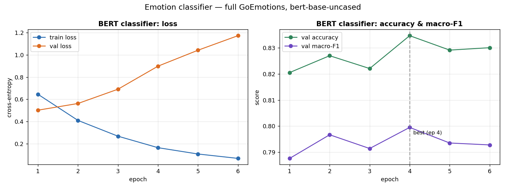
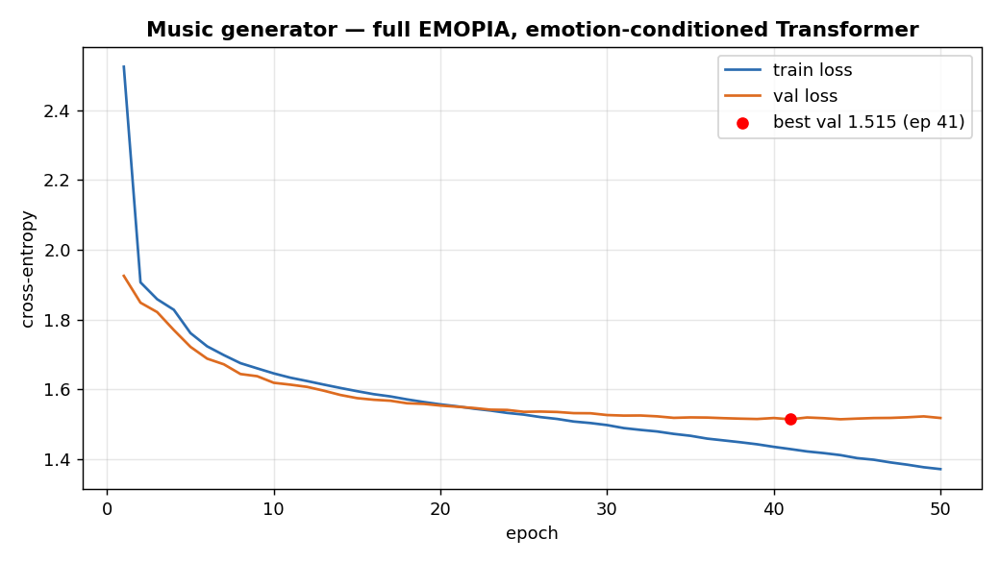

# MUSEmotion

MUSEmotion turns emotion-laden text into a short piano MIDI clip that matches the user's mood. It is built as a full training pipeline for ECE1508, with one model for text emotion classification and one model for conditional symbolic music generation.

## Project Status

This repository contains the end-to-end code structure for:

- fine-tuning BERT on GoEmotions labels mapped into EMOPIA quadrants
- preprocessing EMOPIA piano MIDI files into autoregressive event tokens
- training an emotion-conditioned Transformer music generator
- generating MIDI from free-form text
- launching a Gradio frontend for interactive demos
- running local unit tests without downloading large datasets
- running a verified Colab T4 smoke workflow with the official EMOPIA archive
- shipping full-dataset training charts and trained checkpoints from the latest real-data run

Large datasets and bulky per-epoch optimizer checkpoints are intentionally excluded from git. The repository keeps the music generator checkpoint plus the classifier config, tokenizer, and metrics; the 438 MB `bert-base-uncased` classifier weights are hosted on Google Drive and fetched with `scripts/download_classifier.py`.

## System Overview

```text
User text
  -> BERT emotion classifier
  -> EMOPIA quadrant Q1/Q2/Q3/Q4
  -> conditional Transformer decoder
  -> symbolic note tokens
  -> piano MIDI file
```

The classifier and generator share the same four-label emotion space:

- `Q1`: high valence, high arousal, positive and energetic
- `Q2`: low valence, high arousal, negative and energetic
- `Q3`: low valence, low arousal, negative and subdued
- `Q4`: high valence, low arousal, positive and calm

## Repository Layout

```text
configs/                 YAML configs for classifier, generator, inference, probes, and evaluation
docs/                    design_decisions.md plus superpowers/ planning notes
notebooks/               Colab demo notebook
src/musemotion/          Python package and CLI modules
tests/                   Local tests with synthetic fixtures
scripts/                 Figure generation and classifier download helpers
figures/                 Real training charts and CSV metric histories
samples/                 Committed example MIDI clips, one per quadrant
models/real_training/    Trained checkpoints, MIDI-to-quadrant probes, tokenized EMOPIA splits
data/raw/emopia/         Expected EMOPIA dataset location, ignored by git
artifacts/               Generated datasets, checkpoints, metrics, and samples
```

## Setup

Windows PowerShell:

```powershell
python -m venv .venv
.\.venv\Scripts\Activate.ps1
pip install -r requirements.txt
pip install -e . --no-deps
```

macOS, Linux, or Colab:

```bash
pip install -r requirements.txt
pip install -e . --no-deps
```

## Data Requirements

GoEmotions is loaded directly through Hugging Face Datasets during classifier training:

```python
from datasets import load_dataset
load_dataset("go_emotions")
```

EMOPIA can be downloaded directly from the official Zenodo archive:

```bash
python -m musemotion.cli.download_emopia --output data/raw/emopia
```

The downloader retrieves `EMOPIA_1.0.zip` from [Zenodo record 5090631](https://zenodo.org/records/5090631), extracts it, and leaves MIDI files under:

```text
data/raw/emopia/
```

The EMOPIA preprocessing command recursively scans for `.mid` and `.midi` files whose path contains `Q1`, `Q2`, `Q3`, or `Q4`.

## Design Decisions

Full rationale is in [docs/design_decisions.md](docs/design_decisions.md). Summary:

- **Emotion mapping** is a rule-based table from GoEmotions labels to EMOPIA quadrants ([`src/musemotion/emotions.py`](src/musemotion/emotions.py)): Q1 positive/high-arousal, Q2 negative/high, Q3 negative/low, Q4 positive/low.
- **Dropped labels** (no clear valence, so they are not mapped and their examples are dropped): `neutral`, `surprise`, `confusion`, `realization`. `neutral` is also the most frequent GoEmotions label, so mapping it pushed the classifier toward a single class.
- **Multi-label handling**: each example's labels are mapped, the majority quadrant wins, and ties are dropped.
- **Classifier**: full GoEmotions, `bert-base-uncased`, class-weighted loss to counter quadrant imbalance, checkpoint selected on macro-F1 with early stopping.
- **Music generator**: full EMOPIA; emotion conditioning uses classifier-free guidance (condition dropout in training + `generation.guidance_scale` at sampling) so the quadrants sound distinct; each generated clip uses a distinct seed; `--quadrant` forces an emotion to test the generator without the classifier.

## Training Workflow

Run the stages in this order.

### 1. Train The Emotion Classifier

```bash
python -m musemotion.cli.train_classifier --config configs/classifier.yaml
```

Outputs:

```text
artifacts/classifier/
  metrics.json
  label_mapping.json
  tokenizer files
  fine-tuned BERT checkpoint
```

### 2. Tokenize EMOPIA

```bash
python -m musemotion.cli.prepare_emopia --config configs/music.yaml
```

Outputs:

```text
artifacts/music/tokenizer/vocab.json
artifacts/music/tokenized/train.jsonl
artifacts/music/tokenized/validation.jsonl
artifacts/music/tokenized/test.jsonl
```

Each note is encoded as a compact event group:

```text
SHIFT, PITCH, DUR, VEL
```

### 3. Train The Music Generator

```bash
python -m musemotion.cli.train_generator --config configs/music.yaml
```

The generator is a decoder-only Transformer trained with next-token maximum likelihood. It conditions every timestep on an emotion embedding. Checkpoints are written to:

```text
artifacts/music/checkpoints/
```

## Inference

The default [`configs/inference.yaml`](configs/inference.yaml) uses the trained checkpoints under [`models/real_training/`](models/real_training/). The music generator checkpoint is committed; the `bert-base-uncased` classifier weights download from Google Drive:

```bash
pip install gdown
python scripts/download_classifier.py
```

Generated MIDI files are written to ignored `artifacts/samples/` by default.

Generate a MIDI file from text:

```bash
python -m musemotion.cli.generate \
  --text "I feel hopeful but calm today" \
  --output artifacts/samples/demo.mid
```

The command prints JSON metadata containing the predicted quadrant, confidence, token count, and output MIDI path.

On Windows PowerShell, use backticks for multiline commands:

```powershell
python -m musemotion.cli.generate `
  --text "I feel hopeful but calm today" `
  --output artifacts/samples/demo.mid
```

## Validating The Generated Music

Training loss and classifier accuracy measure prediction, not perception; neither says whether a
listener would hear the intended emotion. Two commands measure the output itself.

Train the MIDI-to-quadrant probes — the models that read generated music back and predict its
quadrant:

```bash
python -m musemotion.cli.train_probe --config configs/probe.yaml
```

Score the generator with them:

```bash
python -m musemotion.cli.evaluate --config configs/evaluation.yaml
```

This writes `artifacts/evaluation/metrics.json` and `comparison_table.csv`, comparing the
generator against real held-out EMOPIA clips, a guidance sweep, two floors (unconditional
sampling and the random-piano baseline), and the end-to-end text-to-music path. Figures come from
`python scripts/plot_evaluation.py --metrics artifacts/evaluation/metrics.json --save`.

Both commands run on the committed probes and tokenized splits, so neither needs the EMOPIA
download.

### Are the judges trustworthy?

Every round-trip number is divided by the probes' own accuracy on real music, so that number has
to come first.

| probe | real held-out EMOPIA | retrained on **permuted labels** |
|-------|----------------------|----------------------------------|
| feature (logistic regression, 28 symbolic features) | 0.657 acc / 0.660 macro-F1 | 0.231 |
| neural (2-layer bidirectional encoder) | 0.602 / 0.595 | 0.324 |

**0.657 is the ceiling, not 1.0.** Four-way symbolic emotion recognition is genuinely hard.

The controls are read against the **majority-class rate of 0.315**, not uniform chance: the test
split runs 20/24/30/34, so always answering Q4 scores 0.315 while learning nothing. The feature
control lands below even uniform chance; the neural control lands at the majority-class rate with
a macro-F1 of 0.271, which is what a run that collapses onto frequent classes looks like. Neither
retains usable signal, which is what makes everything below worth reading.

### Results

Full run on a Colab T4: 200 clips per guidance setting, 40 pre-registered prompts end to end,
guidance swept over 1.0, 2.0, 3.0 and 5.0.

> Reproduce with notebook Step 9a, then run its save-results cell to write the run to
> `models/real_training/evaluation/metrics.json`. Once that file is committed,
> `tests/test_committed_artifacts.py` checks this table against it cell by cell; until then the
> table is a transcription and the test skips with a message saying so.

| system | n | round-trip | 95% CI | arousal | valence | vs ceiling | novel 8-gram | max copy | diversity | fidelity |
|--------|---|-----------|--------|---------|---------|-----------|--------------|----------|-----------|----------|
| **real EMOPIA (ceiling)** | 108 | 0.657 | 0.564–0.740 | 0.880 | 0.713 | 1.000 | 0.991 | **40** | 0.992 | 0.859 |
| guidance 1.0 (CFG off) | 200 | 0.550 | 0.481–0.617 | 0.885 | 0.590 | 0.837 | 1.000 | 6 | 0.983 | 0.795 |
| guidance 2.0 | 200 | 0.710 | 0.644–0.768 | 0.980 | 0.710 | 1.080 | 1.000 | 6 | 0.985 | 0.810 |
| **guidance 3.0 (shipped)** | 200 | **0.790** | 0.728–0.841 | 0.995 | 0.795 | 1.202 | 1.000 | 7 | 0.981 | 0.803 |
| guidance 5.0 | 200 | 0.725 | 0.659–0.782 | 0.995 | 0.730 | 1.103 | 1.000 | 7 | 0.974 | 0.755 |
| unconditional (null emotion) | 200 | — | — | — | — | — | 1.000 | 8 | 0.984 | 0.795 |
| random-piano baseline | 40 | — | — | — | — | — | 1.000 | 3 | 0.913 | **0.324** |
| end-to-end (text → BERT → gen) | 40 | 0.750 | 0.598–0.858 | 0.875 | 0.825 | 1.141 | 1.000 | 6 | 0.978 | 0.694 |

**Classifier-free guidance is what makes the conditioning work.** 0.550 → 0.790 from guidance 1.0
to 3.0, and those intervals do not overlap. Chance is 0.25.

**What survives is arousal; valence only appears with guidance.** With guidance off, valence is
0.590 (lower bound 0.521, barely off the 0.5 coin flip) while arousal is already 0.885. Guidance
adds +0.11 to arousal and **+0.205 to valence** — its contribution is almost entirely to the axis
that was failing. This follows from the tokenizer: arousal is written directly into note density,
velocity and duration, while valence lives in harmony, which `SHIFT/PITCH/DUR/VEL` encodes only
implicitly.

**The failures are directional.** At guidance 3.0, over 200 clips:

```
        recovered →   Q1   Q2   Q3   Q4    recall
conditioned Q1      [ 37   13    0    0]    0.74
            Q2      [  3   47    0    0]    0.94
            Q3      [  0    1   47    2]    0.94
            Q4      [  0    0   23   27]    0.54
```

One cross-arousal error in 200. Forty-one valence errors, of which **36 run positive → negative
and 5 the other way**. Q4 is the weak quadrant: 23 of 50 "positive and calm" clips come back as
"negative and subdued". The generator renders calm as melancholy rather than content.

**It is not copying and not collapsing.** Across all 800 generated clips, not one shares a single
8-note pattern with the training corpus; the longest exactly-copied run is 6–7 notes against real
held-out clips' 40. The generator is *less* derivative of EMOPIA than EMOPIA is of itself.

**Guidance 3.0 is the operating point, but not because it beats 5.0 on accuracy** — 0.790 vs
0.725 overlaps. Because 5.0 buys no accuracy while costing on every other axis: marginal fidelity
0.803 → 0.755, joint distance 1.186 → 1.318, diversity 0.981 → 0.974, and clips shorten from 122
to 108 notes as the EOS rate climbs 0.145 → 0.305. The two probes also agree most at 3.0 (0.800,
against 0.565 on real music) — a label-free signal pointing at the same setting.

**End to end**, the text stage scores 0.850 on the prompt set and the whole chain 0.750. The
stages are not independent: BERT's errors concentrate on Q4, the same quadrant the generator
renders worst, so fixing valence would pay off twice.

### What these numbers do not say

None of them measures whether the music is *good*. They measure controllability, novelty, and
distributional similarity to real EMOPIA. The defensible claim is that the intended emotion is
recoverable from generated audio at a rate approaching what real human-composed music achieves on
the same test, without copying the training data — not that it sounds good. That needs listeners.

Two further caveats are recorded in `metrics.json` under `notes`. Fidelity has two views that can
disagree: per-feature overlap describes the marginals and stays flat across the sweep, while
`inter_over_intra` measures the joint distribution and grows monotonically (1.036 → 1.318) —
guidance keeps each feature in range while moving their combinations away from real music. And
`inter_over_intra` alone is fooled by a collapsed set near the centroid: the random-piano baseline
scores 0.975 on it, nominally closer to real EMOPIA than real held-out clips, while its marginal
overlap of 0.324 correctly ranks it last.

## Frontend Demo

```bash
python -m musemotion.frontend.app --config configs/inference.yaml
```

The Gradio app provides:

- text input for the user's emotional state
- generation controls for temperature, top-k, max tokens, guidance scale, and seed
- predicted quadrant metadata
- downloadable generated MIDI output

The guidance scale slider defaults to `generation.guidance_scale` from the config. A value of
`1.0` disables classifier-free guidance; higher values push the predicted emotion harder.

On Colab the app must be launched with `--share`, and only the printed `gradio.live` public URL
is reachable — the `127.0.0.1` local URL refers to the Colab VM, not your machine.

## Colab

Use [notebooks/musemotion_colab.ipynb](notebooks/musemotion_colab.ipynb) for a shareable Colab workflow.

Open the shareable notebook in Google Colab:

[`https://colab.research.google.com/github/Alex-Xi-Chen/ECE1508-Deep-Generative-Models/blob/main/notebooks/musemotion_colab.ipynb`](https://colab.research.google.com/github/Alex-Xi-Chen/ECE1508-Deep-Generative-Models/blob/main/notebooks/musemotion_colab.ipynb)

The notebook is split into a demo path and clearly marked optional sections:

- **Steps 1-6, the demo (about 5 minutes, CPU is fine).** Install dependencies, download the classifier weights from Google Drive, verify every model file is present, generate a clip from a fixed input text and fixed seed, and play it inline. Run these in order; nothing else is needed.
- **Steps 7-9, optional.** Batch-generate many clips across all four quadrants from a single loaded generator, run your own text through the classifier, or launch the Gradio app with a public share link.
- **Steps 10-13, optional retraining.** A capped smoke run of the whole pipeline (about 5 minutes), then the full uncapped run on a GPU (about 1 to 1.5 hours) with the results zipped to Google Drive.

The demo path uses:

```text
configs/inference.yaml
models/real_training/classifier_bert_base/          (weights via scripts/download_classifier.py)
models/real_training/music_transformer_fulldata/
```

The optional retraining steps use:

```text
configs/colab_smoke_classifier.yaml     smoke retrain
configs/colab_smoke_music.yaml          smoke retrain
configs/inference_colab_smoke.yaml      smoke retrain
configs/classifier.yaml                 full retrain
configs/music.yaml                      full retrain
```

The smoke configs intentionally cap samples and use a smaller generator so the complete training path can run quickly on Colab. The full configs are the ones that produced the checkpoints in `models/real_training/`.

## Colab T4 Run Results

Verified on June 22, 2026, using Google Colab with a Tesla T4 runtime. These are point-in-time
figures from that run: the test suite has since grown to 20 tests, and the smoke training numbers
below are superseded by the full-dataset results in the next section.

```text
torch 2.11.0+cu128
cuda_available True
cuda_device Tesla T4
Tesla T4, 15360 MiB, driver 580.82.07
pytest: 19 passed in 2.90s
```

Dataset download and discovery:

```text
EMOPIA dataset ready at /content/ECE1508-Deep-Generative-Models/data/raw/emopia
emopia_midi_count 1078
emopia_quadrant_counts {'Q1': 250, 'Q2': 265, 'Q3': 253, 'Q4': 310}
```

Smoke BERT classifier fine-tuning:

```text
train_runtime 8.419s
train_loss 1.28
test eval_accuracy 0.5357
test eval_macro_f1 0.1744
test eval_loss 1.2021
```

Smoke music preprocessing and generator training:

```text
tokenized_train_count 52
tokenized_validation_count 6
tokenized_test_count 6
epoch=1 train_loss=4.7669 validation_loss=4.4705
```

End-to-end generated sample:

```text
input_text "I feel hopeful but calm today"
predicted_quadrant Q4
confidence 0.3413
token_count 174
sample_path artifacts/colab_smoke/samples/hopeful_calm.mid
sample_exists True
sample_size_bytes 112
sample_note_count 5
sample_duration_seconds 4.25
```

The smoke run proves the pipeline executes end to end on GPU. The musical quality should improve with the uncapped configs and longer generator training.

## Real Multi-Epoch Training Results

These results come from training on the full datasets (uncapped `configs/classifier.yaml` and `configs/music.yaml`) on a Colab T4. The charts are regenerated from the committed CSV histories with `python scripts/plot_training.py`.

### Emotion classifier

- base model: `bert-base-uncased`
- data: full GoEmotions mapped to EMOPIA quadrants, 25,873 train / 3,249 validation / 3,270 test (after dropping the no-clear-valence labels `neutral`, `surprise`, `confusion`, `realization` and cross-quadrant ties)
- training: class-weighted cross-entropy, best checkpoint selected on validation macro-F1 (epoch 4)
- test set: accuracy 0.828, macro-F1 0.788 (4-class chance is 0.25)
- history: [`models/real_training/classifier_bert_base/training_history.csv`](models/real_training/classifier_bert_base/training_history.csv)



Validation loss rises after a couple of epochs while accuracy and macro-F1 stay around 0.83 / 0.79, so the checkpoint is selected on macro-F1 rather than loss.

### Music generator

- model: emotion-conditioned Transformer (d_model 256, 4 layers, 8 heads)
- data: full EMOPIA, 862 train / 108 validation / 108 test tokenized clips
- training: 50 epochs, best validation loss 1.519 at epoch 38
- history: [`models/real_training/music_transformer_fulldata/training_history.csv`](models/real_training/music_transformer_fulldata/training_history.csv)



Additional charts under `figures/`:

- [`learning_curves.png`](figures/learning_curves.png)
- [`overfitting_analysis.png`](figures/overfitting_analysis.png)
- [`best_metrics.png`](figures/best_metrics.png)
- [`performance_summary_table.png`](figures/performance_summary_table.png)
- [`real_training_summary.csv`](figures/real_training_summary.csv)

Sample clips, one per quadrant (generated by conditioning the generator directly on each quadrant with classifier-free guidance), are committed under [`samples/`](samples/): `Q1_positive_energetic.mid`, `Q2_negative_energetic.mid`, `Q3_negative_subdued.mid`, `Q4_positive_calm.mid`.

End-to-end demo clips are committed separately under [`artifact/samples/`](artifact/samples/), one per quadrant, each named after the sentence that produced it: `demo_I_feel_happy_and_hopeful_today.mid` (Q1), `demo_I_feel_nervous_and_panicked_today.mid` (Q2), `demo_I_feel_sad_and_gloomy_today.mid` (Q3), and `demo_I_feel_calm_and_grateful_today.mid` (Q4). Unlike the forced-quadrant clips above, these ran the full pipeline — the BERT classifier picked the quadrant from the text, then conditioned the generator on it — with classifier-free guidance at the `configs/inference.yaml` default of 3.0. Note that generation is deterministic given the quadrant, seed and sampling settings, so a clip whose emotion was predicted is byte-identical to one whose quadrant was forced; matching bytes recover the settings, never which code path ran.

Trained checkpoints are under [`models/real_training/`](models/real_training/):

- [`models/real_training/classifier_bert_base/`](models/real_training/classifier_bert_base/) — config, tokenizer, label mapping, and metrics are committed; `pytorch_model.bin` (438 MB) is fetched with [`scripts/download_classifier.py`](scripts/download_classifier.py)
- [`models/real_training/music_transformer_fulldata/`](models/real_training/music_transformer_fulldata/) — `best.pt`, tokenizer, histories

Large datasets and per-epoch optimizer checkpoints remain excluded from git.

## Local Verification

The local tests are designed to run without GoEmotions, EMOPIA, GPU access, or trained checkpoints.

```bash
pytest -q
```

Current local coverage includes:

- YAML config loading
- GoEmotions-to-EMOPIA mapping
- Hugging Face GoEmotions dataset compatibility
- official EMOPIA archive download and retry behavior
- MIDI token encode/decode behavior
- tokenized dataset collation
- Transformer forward pass and loss shape
- CLI import safety
- inference orchestration with fake components
- deterministic random piano generator baseline

## Configuration

- `configs/classifier.yaml`: BERT model name, max sequence length, classifier training settings
- `configs/music.yaml`: EMOPIA paths, MIDI tokenization settings, Transformer architecture, generator training settings
- `configs/inference.yaml`: classifier checkpoint, generator checkpoint, tokenizer path, sampling defaults
- `configs/probe.yaml`: MIDI-to-quadrant probe architecture, training settings, shuffled-label control
- `configs/evaluation.yaml`: clip counts, guidance sweep, novelty settings, end-to-end prompt set
- `configs/evaluation_smoke.yaml`: the same run capped for a laptop; its numbers are not reportable

## Notes

- `data/`, `artifacts/`, `checkpoints/`, `output/`, `.venv/`, and `.superpowers/` are ignored.
- The repo does not ship the raw EMOPIA audio or MIDI, or the bulky training artifacts. It does ship the tokenized EMOPIA splits (3.5 MB) under `models/real_training/emopia_tokenized/`, so the evaluation and probe training run without the 1 GB dataset download; EMOPIA is CC BY 4.0 and that folder carries the attribution.
- The repo ships the music generator checkpoint and the MIDI-to-quadrant probes under `models/real_training/`; the `bert-base-uncased` classifier weights are fetched from Google Drive via `scripts/download_classifier.py`.
- The implementation is meant to train on GPU or Colab, while remaining testable on a normal laptop.
